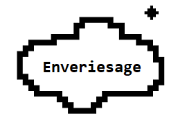
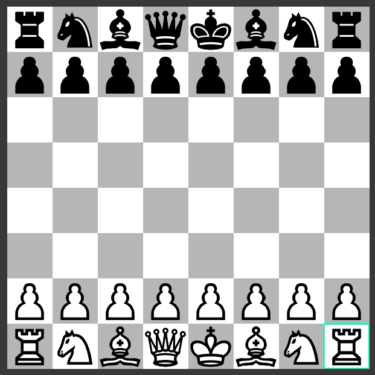

# x86_Chess

### Brief Description
Classic Chess Game using x86 Assembly Language.
### Instalation Guide
1. Download all files in this Repository. ( Make sure it has the same location format like in this repository )
2. Download `TASM` that integrated with `DOSBox`. ( Not the GUI TASM )
3. Copy all files and folder that have been downloaded in this Repository to `TASM` folders.
4. Mount the `TASM` Folder in the `DOSBox`.
5. Assemble the `main.asm`in the `DOSBox` using `TASM`.
6. TLINK the `main.obj`.
7. Type `main.exe` and Enjoy the Game!!!
### Important Notes : Make sure you Assemble `main.asm` by using `TASM /zi /m main.asm`

### Documentation

